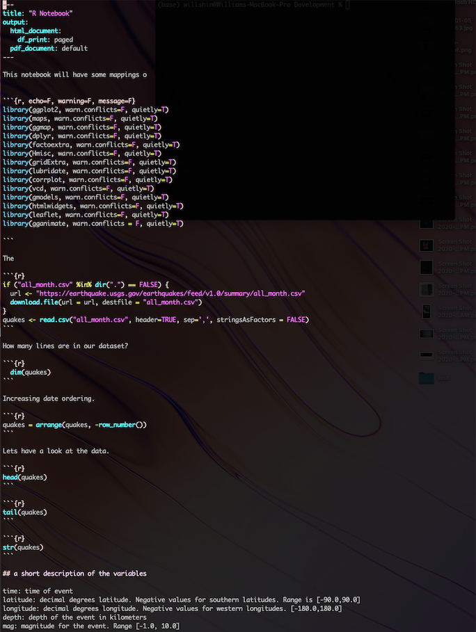

# Intro to terminal!

## Sam Bail // @spbail
Enterprise Partnerships at Superconductive

---

## Intro

- Hello! I'm Sam!
	- I'm a data... person in New York City, and I run our Partnerships team at Superconductive
	- We are the team behind Great Expectations, an awesome open source tool for data quality!
- Plan for today:
	- Some background and terminology
	- Basic navigation, file manipulation, searching
	- Environment variables and shell profile
	- Shell scripting

---
## Workshop structure
- I will mostly be showing slides and demo-ing in the terminal
- There will be stops after each section for questions
- We will have time for an FAQ at the end
- The **DIY** blocks are mini-exercises you can try out after the workshop

---

# Background & terminology

---

## What are all these words?

- **Shell**: user interface (command-line or graphical)
    - Usually shell = command-line user interface
    - The Wikipedia pages on "Unix shell" and "Bash (Unix shell)" are a good read if you're interested in some history!
- **Bash**: a type of shell (“Bourne-Again SHell”)*
    - There are others: zsh, ksh…
    - macOS switched from bash to zsh in 10.15
    - The basics are all the same :)
- **Terminal**: the program than runs a shell

---

## Why use the terminal/shell?

- It’s often faster or more flexible
    - Bulk operations on files
    - Searching for files/text in files
    - ...
- Sometimes you have to 
    - Connecting to a server via ssh
    - Setting aliases or environment variables
    - ...

---

# Navigating the file system

---

## Let's get started

- Some basics to navigate the file system:
    - `pwd`: path of current working directory (usually your terminal will open a shell in your home directory, but you can change that in settings)
    - `ls`: list files in the directory
    - `ls -l`: = add a “long format” flag
    - `ls -la`: add long format + “all” flag
- How do we know what flags are available?
    - `man ls`: man(ual) pages
    - `<space bar>`: navigate down 
    - `q`: get out of `man` (and lots of other shell programs)!
- **DIY:** check man and try out different flags for `ls`

---

## Some helpful terminal shortcuts

- `clear`: refresh your terminal window
- `<Up arrow>`: cycle through previous commands
- `<Tab>`: bash will tab-complete file/dir paths
- `<CTRL+c>`: exit pretty much any process
- `<CTRL+a>/<CTRL+e>`: go to start/end of line
- `<CTRL+w>`: delete word before the cursor
- `<CTRL+r>`: incremental reverse search through previous commands, keep hitting `<CTRL+r>` to cycle
- **DIY**: use `<CTRL+r>` to find and run your first `pwd` command

---

## Navigating the file system

- `cd <directory>`: go to <directory>
    - Use pwd, tab-complete and ls for orientation!
- Example:
    - Use `pwd` to see where you are, then `ls` to list contents of the directory
    - Change to the "code" subdir with `cd code` and list contents with `ls`
- Some useful aliases for directories:
    - `~`: alias for your home directory (/Users/<name>)
    - `.`: alias for the current directory 
    - `..`: alias for the parent directory
- **DIY:** Try out navigating your file system using names and aliases

---

# Basic file operations

---

## File operations (1)

- `mkdir <directory>`: make a directory
- `touch <filename>`: create an empty file called <filename>
- `open (filename)`: open file in default text editor`
- Example:
    - `mkdir some_dir` and `cd some_dir`
    - `touch hello.txt` and `ls` to see that file was created
    - `open hello.txt` to open the file in your system's default editor
- **DIY**: Try out this workflow!

---

## File operations (2)
- `cp <file1> <file2>`: copy file1 to file2
    - `cp hello.txt hello2.txt`
    - `ls`
- `mv <file1> <file2>`: rename file1 to file2
    - `mv hello2.txt hello3.txt`
    - `ls` - we now have only hello.txt and hello3.txt
- `rm <file>`: remove file (irreversibly!)
- Use wildcard `*` in file names for any operation
    - `ls hello*` will show all files starting with "hello"

---

## Looking at file content (1)

- I'm using a file (permits.csv) from NYC OpenData as an example
- `cat`: print content of file
- `head`: cat, but only show the top n rows of a file
- `tail`: like head, but shows bottom n rows
- Example: 
    - `cat permits.csv`
    - `head permits.csv` and `head -n 2 permits.csv`
    - `tail permits.csv` and `tail -n 2 permits.csv`

---

## Looking at file content (2)

- `less`: interactive text reader (a little fancier than `cat`)
    - `less permits.csv` 
- Navigate with arrow keys, skip whole pages with `<space bar>`
- Lots of other functionality in `less`, but let's exit with `q`
    - (What does this remind you of?)

---

# Finding text in files

---

## Finding text in files (1)

- Option 1: `less` has a built-in search
- `less permits.csv`
    - `/` (this gets you the search prompt)
    - type for example `film` and hit enter
    - This will say “Pattern not found” because the search is case sensitive
- Case insensitive search:
    - Type `-I` to make the search case insensitive
    - Try searching again!
- `p` and `n`: jump to previous/next occurrence of the search word

---

## Finding text in files (2)

- Option 2: use `grep`
- `grep <search word> <file>`
    - Example: `grep film permits.csv`
    - No results! grep is case sensitive, too
    - Try `grep -i film permits.csv`
- grep returns all lines containing the search word
- Works best with line-based files, e.g. CSV
- **DIY**: grep for the word “theater”

---

## Chaining commands using a pipe

- This is not file related, but I use it a lot in the way shown here!
- `|`: the pipe operator chains any two commands and "pipes" the output of command a into command b
    - `<command a> | <command b>`
- Let's try this:
    - `wc -l <file>`: counts lines in a file, e.g. `wc -l permits.csv`
    - `grep -i film permits.csv | wc -l` pipes the result of the `grep` to `wc`
- Pipes can be chained, e.g. `<command a> | <command b> | <command c>`
    - Output of a = input to b
    - Output of b = input to c
    
---

## DIY: Mini-project

- Go to the directory with permits.csv
- Look at the file using `head`, `tail`, and `less`
- Get some counts using `grep` and `wc`:
    - How many lines are in the file?
    - How many lines contain the word “Television”?
    - How many lines contain the word “Television” and your own ZIP code? (Hint: remember you can chain pipes!)
    
    
---

# Finding files

---

## Finding files

- The `find` command lets you find files based on search criteria
- `find <directory> -name "<search word>"`
- I mostly use it to find filenames, e.g.
    - `find . -name "per*"`: find file starting with "per"
    - `find . -iname "PER*"`: case insensitive version
    - `find . -name "*.csv"`: find file type with extension ".csv"
- You can also specify a directory to search in:
    - `find ~/code -name "*.csv"`
    - `find` is recursive by default (yay)
    - I sometimes do stuff like `find ~/code -name "npi*.csv" | grep wc -l`

---

# Environment variables and profile files

---

## Environment variables

- Environment variables are system-wide global variables that your shell knows about
- `env`: show all environment variables
- You can access any variable using the $ sign
    - `echo $USER <your username>`
    - `echo $HOME <your home directory>`
- We also just learned the `echo` command that prints text to the terminal
    - `echo "hello"`: this just prints the "hello""
    - `echo "hello $USER"`: variables are substituted in an `echo` statement

---

## Setting environment variables

- `export <varname>=<value>` sets an environment var
    - `export myvar=42` or `export myvar="some text"`
    - `echo $myvar`
- Setting environment vars is often done for software to know where to find relevant libraries, e.g. `$PYTHONPATH`
- **Two important things to note**:
    - Spaces and quote types matter in bash
    - Any environment variable you set in a shell will **only** be known to this instance of the shell, e.g. `echo $myvar` in a **new** terminal tab or window won't show anything
    
---

## Your shell profile - .bash_profile or .zsh_profile (1)

- Every terminal window/tab only knows about its own environment variables
- Variables that are needed everywhere need to be exported at startup
- Your terminal reads a “profile” file at startup to "source" environment variables, functions, aliases, etc.
    - bash: ~/.bash_profile, ~/.profile, ~/.bashrc - feel free to read up on the differences!
    - zsh: ~/.zshrc

---

## Your shell profile (2)

- Let’s export a new environment variable via the shell profile
    - `open ~/.zshrc`
    - Add this line: `export anothervar=”hello”`
    - Save the file
    - `echo $anothervar`
- My open shell doesn’t know about changes to .zshrc automatically, I need to:
    - Either: open a new terminal which will source the profile at startup
    - Or: run `source ~/.zshrc`
   
    
---

# Shell scripting 101

---

## A simple shell script

- Instead of typing commands, you can also add them to a file and execute the file
- My script "samscript.sh" does a simple `echo`
- There are several options to execute a script:
    - `./samscript.sh`
    - `bash samscript.sh`
    - `sh samscript.sh`
- DIY: create a new file myscript.sh and add a line to echo “Hello $USER!”, save the file, and execute
    - You’ll get a “permission denied” error

---

## File permissions 101

- Files in your file system have permissions for who can do what
    - `ls -l` shows `-rw-r--r--` for samscript.sh
- The permissions are as follows:
    - The first bit is either `d` (directory) or `-` (file)
    - Then we have 3-letter-blocks each for owner/user, group, other
    - `r`: read, `w`: write, `x`: execute, `-`: permission not set
- The `chmod` command changes the “mode” (permissions) of a file
    - `chmod u+x samscript.sh` to allow the user to execute the script
    - `ls -l samscript.sh` to show the updated permissions
- We can now run the script with `./samscript.sh`!

---

## DIY: Mini-project 2

- Create a new bash script
- Add at least 2 commands you’ve learned
- Save the file
- Set the right permissions
- Execute the script

---

---

## Wrapping up

- We’ve covered:
    - Directory navigation and file manipulation
    - Searching for text and finding files
    - Environment variables and your shell profile
    - Your first shell script
- Other important or fun bash stuff to look up (e.g. using `man`):
    - The `sudo` command
    - Setting an alias (shortcut) for shell commands
    - Using vim as text editor
    - Other ways to exit and kill processes (CTRL+z, CTRL+d…)
    - Utilities like `cal`, `date`, disk space checking, `cowsay`...
    
---

# That's it!
### Feel free to connect with me on Twitter @spbail!